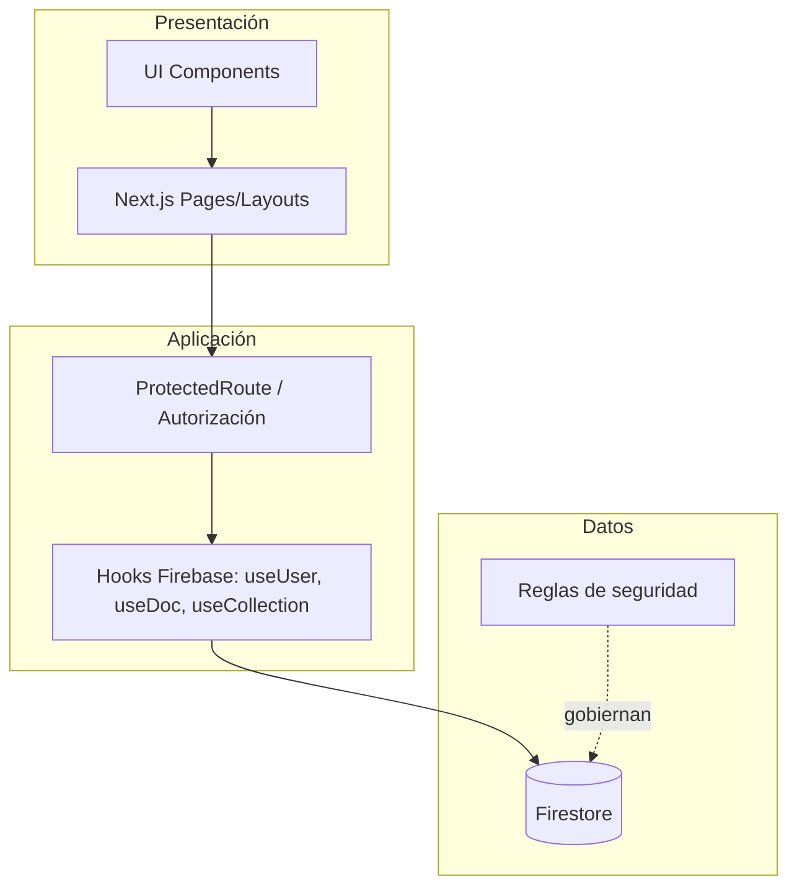

# Taller 1 – IPS Virtual: Salud en Casa

Documento de práctica: Integración de aprendizajes, trabajo en equipo, planificación ágil y arquitectura de software.

Fecha: 15 de octubre de 2025

Repositorio: https://github.com/Staillim/My-IPS-Virtual

PDF sugerido: exportar este Markdown a PDF desde VS Code (Markdown PDF) o GitHub → Print to PDF.

---

## Tabla de contenido
- [Introducción](#introducción)
- [Lista de definiciones, acrónimos y abreviaturas](#lista-de-definiciones-acrónimos-y-abreviaturas)
- [Sistema propuesto](#sistema-propuesto)
- [Sprint 0](#sprint-0)
- [Ingeniería de requerimientos y estimación](#ingeniería-de-requerimientos-y-estimación)
- [Diseño de software](#diseño-de-software)
- [Patrones de construcción de software](#patrones-de-construcción-de-software)
- [Referencias](#referencias)

---

## Introducción

### Cliente y usuarios finales (0.2)
- Cliente: IPS Virtual – Salud en Casa (proyecto académico con enfoque realista para un servicio de salud a domicilio y remoto).
- Usuarios finales:
  - Pacientes: agendan y gestionan citas, reciben notificaciones, consultan fórmulas y su historial.
  - Personal médico: gestiona citas, fórmulas, pacientes asignados.
  - Administradores: gestionan médicos, servicios, reportes y estadísticas.

### Problema
Muchas IPS y consultorios enfrentan dificultades para:
- Centralizar la agenda médica y la comunicación con pacientes.
- Notificar cambios (confirmaciones, recordatorios, fórmulas) de forma segura y oportuna.
- Mantener acceso diferenciado por rol sin vulnerar la privacidad del paciente.

IPS Virtual resuelve estas necesidades con un portal unificado, seguro y responsivo que integra agendamiento, notificaciones y manejo de fórmulas y perfiles, con control de acceso por roles.

---

## Sistema propuesto (0.2)

### Propósito del sistema
Proveer una plataforma web para atención médica remota y en casa: “IPS Virtual – Salud en Casa”. El sistema:
- Permite a pacientes agendar y ver citas, recibir notificaciones, consultar fórmulas e historial.
- Permite a personal médico gestionar pacientes, citas y fórmulas.
- Provee a administradores herramientas de gestión de usuarios, servicios, reportes y estadísticas.

### Alcance (versión actual)
Incluido en esta versión:
- Autenticación y control de acceso por roles (Paciente, Personal, Admin).
- Dashboard por rol (paciente, personal, admin).
- Módulo de citas: consulta y gestión básica por rol.
- Notificaciones por usuario (lectura / no leídas).
- Fórmulas activas visibles por paciente.
- Seguridad en frontend (ProtectedRoute) y reglas de Firestore.
- Landing page con branding “IPS Virtual – Salud en Casa”.

Fuera de alcance (posibles iteraciones futuras):
- Teleconsulta por video integrada (placeholder en UI).
- Pasarela de pagos y facturación.
- Auditoría avanzada y firma digital de historias clínicas.
- Integración HL7/FHIR con HIS/EMR externos.

---

## Sprint 0 (0.6)

### Equipo de trabajo
- Integrantes y roles: (Completar por el equipo)
  - Harry Elian Gongora Vasquez – Product Owner
  - Harry Elian Gongora Vasquez – Scrum Master
  - Harry Elian Gongora Vasquez – Frontend Dev
  - Harry Elian Gongora Vasquez – Backend/Cloud Dev
  - Harry Elian Gongora Vasquez – QA/Tester

### Marco de trabajo ágil
- Marco: Scrum.
- Ceremonias implementadas:
  - Sprint Planning (1.5 h por sprint de 2 semanas): priorización y definición de Sprint Goal.
  - Daily (15 min, diario): sincronización de impedimentos y progreso.
  - Sprint Review (45 min): demo de incrementos a stakeholders.
  - Sprint Retrospective (45 min): áreas de mejora y acciones.
- Definition of Ready (DoR) y Definition of Done (DoD) documentadas en el tablero.

### Herramientas
- Frontend: Next.js 15, React 18, TypeScript, TailwindCSS, Radix UI.
- Backend/BaaS: Firebase (Auth, Firestore), Genkit opcional para IA.
- Base de datos: Firestore (NoSQL) con reglas estrictas.
- Control de versiones: Git + GitHub → https://github.com/Staillim/My-IPS-Virtual
- Gestión del proyecto: GitHub 


### Planeación de sprints y backlog
- Backlog en herramienta (Notas) con épicas por módulo: Autenticación, Citas, Notificaciones, Fórmulas, Admin.
- Sprints de 2 semanas; se ajusta el backlog conforme avanza el proyecto manteniendo priorización por valor/riesgo.
- Épicas → Historias de Usuario → Tareas técnicas + Criterios de aceptación.

### Módulos del sistema (≥4)
- Autenticación y perfiles: login/registro y perfil en `/login`, `/signup`, `/dashboard/perfil`.
- Paciente: dashboard, citas, fórmulas, notificaciones.
- Personal médico: dashboard, gestión de citas y pacientes asignados.
- Administración: gestión de médicos, servicios, reportes, estadísticas.
- Notificaciones: feed por usuario con leídas/no leídas.

---

## Ingeniería de requerimientos y estimación (1.5)

Nota: Las HU deben estar en la herramienta de gestión. Aquí se documentan y se referencia su creación en el tablero.

### Requerimientos funcionales – Historias de Usuario por módulo

1) Autenticación y perfiles
- HU-AUT-01: Como visitante quiero registrarme para acceder al portal.
  - Criterios: (Dado/Cuando/Entonces)
    - Dado formulario válido, Cuando envío, Entonces se crea usuario y perfil en `users/{uid}` con rol “PACIENTE”.
    - Dado email existente, Cuando envío, Entonces recibo error claro.
- HU-AUT-02: Como usuario quiero iniciar sesión para entrar a mi dashboard.
  - Criterios: redirección por rol: Admin→`/dashboard/admin`, Personal→`/dashboard/personal`, Paciente→`/dashboard`.

2) Paciente
- HU-PAC-01: Como paciente quiero ver mis próximas citas.
  - Criterios: muestra máximo 3 citas próximas; ordenadas por fecha asc.; skeleton mientras carga.
- HU-PAC-02: Como paciente quiero ver mis notificaciones no leídas y marcarlas como leídas.
  - Criterios: contador de no leídas; acción de marcar como leído persiste en `notifications`.
- HU-PAC-03: Como paciente quiero ver mis fórmulas activas.
  - Criterios: solo estado “activa”; máximo 3; acceso a detalle.

3) Personal médico
- HU-PER-01: Como personal quiero ver y gestionar mis citas asignadas.
  - Criterios: listado filtrado por `doctorId`; cambiar estado ‘pendiente’↔‘confirmada’. Acceso restringido por rol.
- HU-PER-02: Como personal quiero ver pacientes asignados y su última evolución.

4) Administración
- HU-ADM-01: Como admin quiero gestionar médicos (crear/editar roles y perfiles).
- HU-ADM-02: Como admin quiero ver estadísticas generales (citas por estado, servicios más usados).

5) Notificaciones
- HU-NOT-01: Como sistema quiero enviar notificación a usuario ante cambio de estado de cita.
  - Criterios: crea doc en `notifications` con `userId`, `type`, `read=false`.

Asignación y estado: Cada HU en la herramienta con responsable(s), etiquetas de módulo y sprint.

### Requerimientos no funcionales (RNF)
- Seguridad: control de acceso por rol en frontend y reglas Firestore; mínimo privilegio.
- Rendimiento: cargas de dashboard < 1.5s con caché ligera de consultas; paginación cuando aplique.
- Usabilidad: diseño responsivo, componentes accesibles (Radix UI); internacionalización futura.
- Compatibilidad: navegadores modernos, mobile-first.
- Disponibilidad: 99.5% objetivo (Firebase). Recuperación ante fallos básica.
- Privacidad: datos mínimos, cumplimiento de buenas prácticas de protección de datos.

### Estimación
- Técnica: Planning Poker con Story Points (SP) y conversión aproximada por velocidad de equipo.
- Supuestos:
  - Velocidad inicial: 20 SP/sprint (2 semanas, 5 personas dedicación parcial).
  - Conversión de referencia (no contractual): 1 SP ≈ 3-5 horas efectivas.
- Ejemplo de estimaciones:
  - HU-AUT-01: 5 SP; HU-AUT-02: 3 SP
  - HU-PAC-01: 5 SP; HU-PAC-02: 3 SP; HU-PAC-03: 3 SP
  - HU-PER-01: 5 SP; HU-ADM-01: 8 SP; HU-NOT-01: 3 SP
- Costeo: si aplica, multiplicar horas estimadas por tarifa/hora del equipo.

---

## Diseño de software (1.3)

### Arquitectura del proyecto
- Enfoque por capas en una app Next.js con BaaS (Firebase):
  - Presentación (Next.js App Router, componentes UI)
  - Aplicación (hooks, lógica de navegación/roles)
  - Datos (Firestore, reglas de seguridad)

Diagrama general (Mermaid):


### Especificación arquitectónica – por capas

1) Capa de presentación
- Rutas y layouts en `src/app/**` (Next.js App Router)
  - Landing: `src/app/page.tsx`
  - Dashboard por rol: `src/app/dashboard/**`
  - Layouts protegidos: `src/app/dashboard/admin/layout.tsx`, `src/app/dashboard/personal/layout.tsx`
- Componentes UI (Radix + Tailwind) en `src/components/ui/**` y específicos como `patient-dashboard.tsx`.

2) Capa de aplicación
- Autorización y navegación por rol: `src/components/auth/ProtectedRoute.tsx`
- Hooks de datos: `src/firebase/firestore/use-doc.tsx`, `use-collection.tsx` y utilidades `@/firebase`.

3) Capa de datos
- Firestore con colecciones: `users`, `appointments`, `notifications`, `formulas`, `services`, `departments`, `cities`.
- Reglas de seguridad en `firestore.rules`.

Modelo entidad–relación (conceptual) – Mermaid:
```mermaid
erDiagram
  USERS ||--o{ APPOINTMENTS : "tiene"
  USERS ||--o{ NOTIFICATIONS : "recibe"
  USERS ||--o{ FORMULAS : "posee"
  DOCTORS ||--o{ APPOINTMENTS : "atiende"
  SERVICES ||--o{ APPOINTMENTS : "se_agenda_para"

  USERS {
    string id PK
    string role  // PACIENTE|PERSONAL|ADMIN
    string name
    string email
  }
  DOCTORS {
    string id PK
    string name
    string specialty
  }
  APPOINTMENTS {
    string id PK
    string patientId FK
    string doctorId FK
    date   date
    string status  // pendiente|confirmada|cancelada
  }
  NOTIFICATIONS {
    string id PK
    string userId FK
    string type
    boolean read
    date createdAt
  }
  FORMULAS {
    string id PK
    string patientId FK
    string status // activa|vencida
  }
  SERVICES {
    string id PK
    string name
  }
```

Mockups/wireframes: se han implementado directamente en UI con componentes; ver `src/app/page.tsx` (landing) y `src/components/dashboards/patient-dashboard.tsx`.

---

## Patrones de construcción de software (1.2)

Se seleccionan y aplican al menos 3 patrones con breve ejemplo y referencia al código:

1) Singleton (Creacional)
- Uso: inicialización de Firebase App y acceso compartido a instancias (evitar múltiples inicializaciones).
- Referencia: `src/firebase/index.ts`, `src/firebase/provider.tsx` (proveedor único del contexto de Firebase).
- Beneficio: una sola fuente de verdad de servicios.

2) Strategy / Policy (Comportamiento)
- Uso: enrutamiento condicional por rol en `ProtectedRoute` y `dashboard/page.tsx`.
- Ejemplo: dado un usuario con rol ADMIN → estrategia dirige a `/dashboard/admin`; con PERSONAL → `/dashboard/personal`; con PACIENTE → `/dashboard`.
- Beneficio: separar políticas de acceso del resto de la UI.

3) Observer (Comportamiento)
- Uso: Firestore y suscriptores (hooks `useCollection`, `useDoc`) reaccionan a cambios en tiempo real.
- Referencia: `src/firebase/firestore/use-collection.tsx` y `use-doc.tsx` consumidos en dashboard y notificaciones.

4) Adapter (Estructural) – opcional adicional
- Uso: hooks internos adaptan la API de Firestore a una interfaz React-friendly (`isLoading`, `data`).
- Beneficio: desacoplamiento entre Firestore y componentes de UI.

5) Factory (Creacional) – opcional adicional
- Uso: funciones que construyen queries dinámicas (por rol/usuario) con parámetros en hooks `useMemoFirebase`.

Fragmento ilustrativo mínimo (Strategy/Policy):
```tsx
// src/components/auth/ProtectedRoute.tsx (extracto)
if (userData && allowedRoles?.length) {
  if (!allowedRoles.includes(userData.role)) {
    if (userData.role === 'ADMIN') router.push('/dashboard/admin');
    else if (userData.role === 'PERSONAL') router.push('/dashboard/personal');
    else router.push('/dashboard');
  }
}
```

---

## Lista de definiciones, acrónimos y abreviaturas
- IPS: Institución Prestadora de Salud.
- RNF: Requerimiento No Funcional.
- HU: Historia de Usuario.
- BaaS: Backend as a Service.
- ACL: Access Control List (lista de control de acceso).
- ER: Entidad–Relación.
- SPA/SSR: Single Page App / Server-Side Rendering.

---

## Seguridad (resumen)
- Frontend: `ProtectedRoute` aplicado en layouts protegidos (`/dashboard/admin`, `/dashboard/personal`), y redirecciones por rol en `dashboard/page.tsx`.
- Backend (Firestore Rules):
  - Usuarios solo pueden leer/escribir su propio documento en `users/{userId}`.
  - `departments` y `cities` lectura pública, sin escrituras de cliente.
  - Roles respetados mediante validación del `uid` y estructura de colecciones.
- Documento ampliado: `SECURITY.md`.

---

## Referencias
- Código fuente del proyecto: https://github.com/Staillim/My-IPS-Virtual
- Next.js 15: https://nextjs.org/
- React 18: https://react.dev/
- TailwindCSS: https://tailwindcss.com/
- Radix UI: https://www.radix-ui.com/
- Firebase (Auth/Firestore/Rules): https://firebase.google.com/
- Genkit: https://firebase.google.com/docs/genkit
- Documentación interna: `SECURITY.md`, `firestore.rules`

---

## Notas para la entrega en PDF
- Completar nombres de equipo y links de tablero (Trello/Jira).
- Verificar que las HU estén creadas en la herramienta de gestión.
- Exportar a PDF. Incluir portada con nombre del curso, integrantes y fecha.
